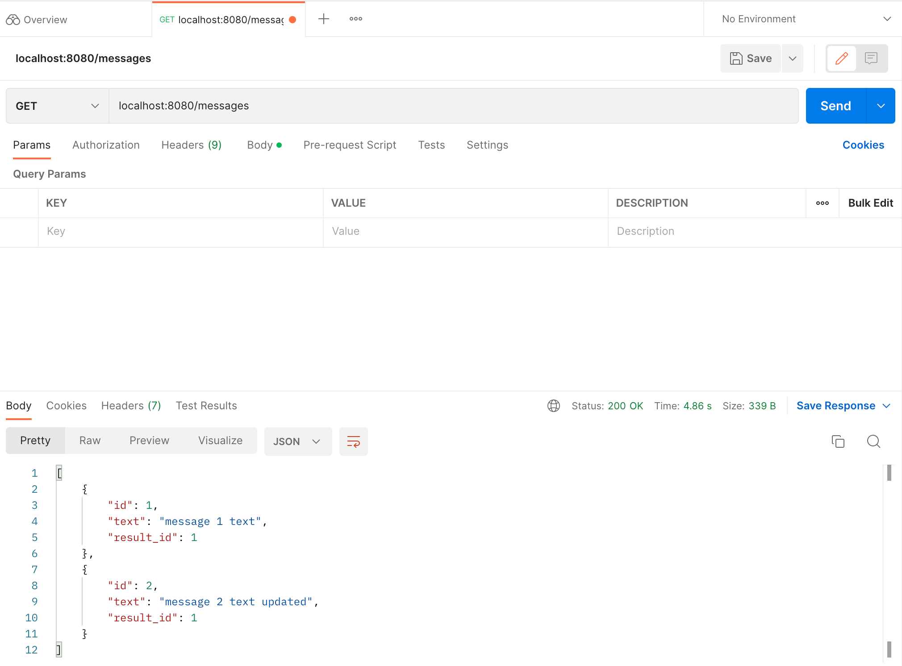
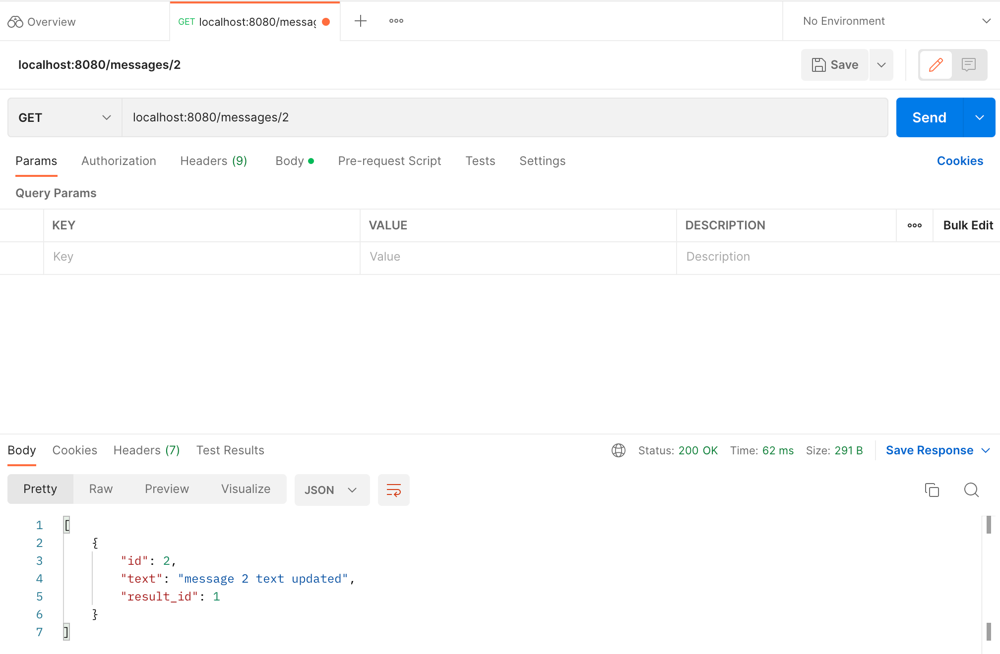
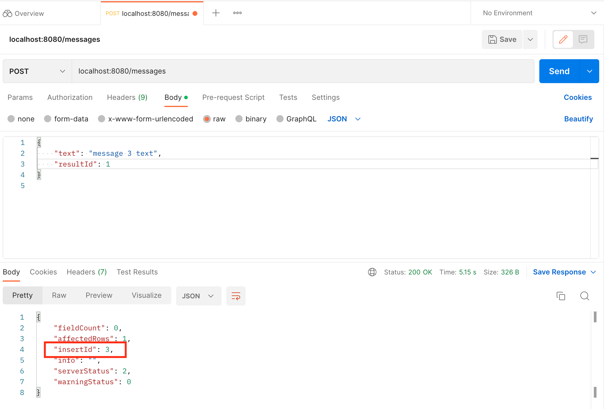
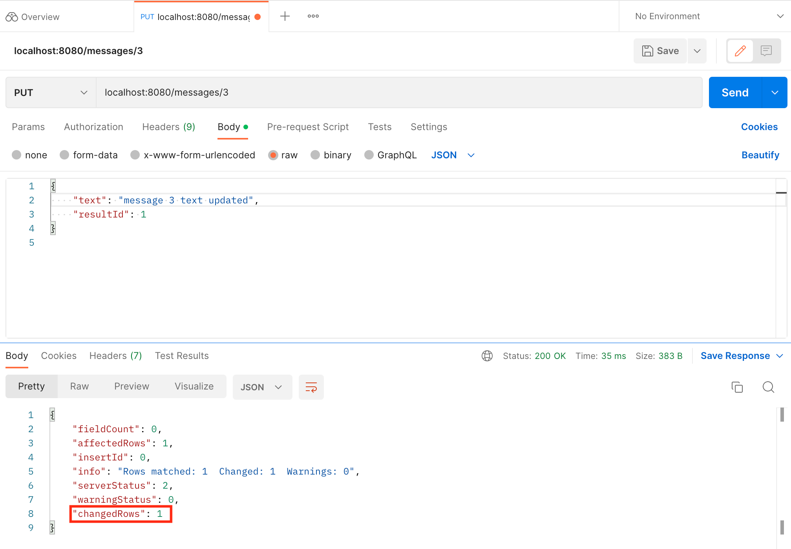
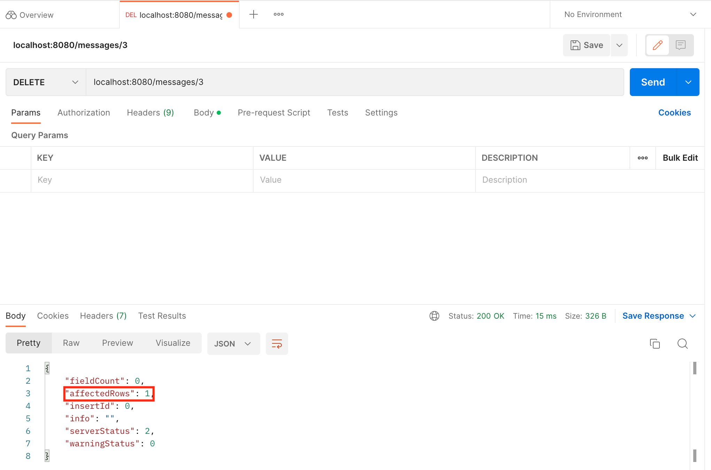
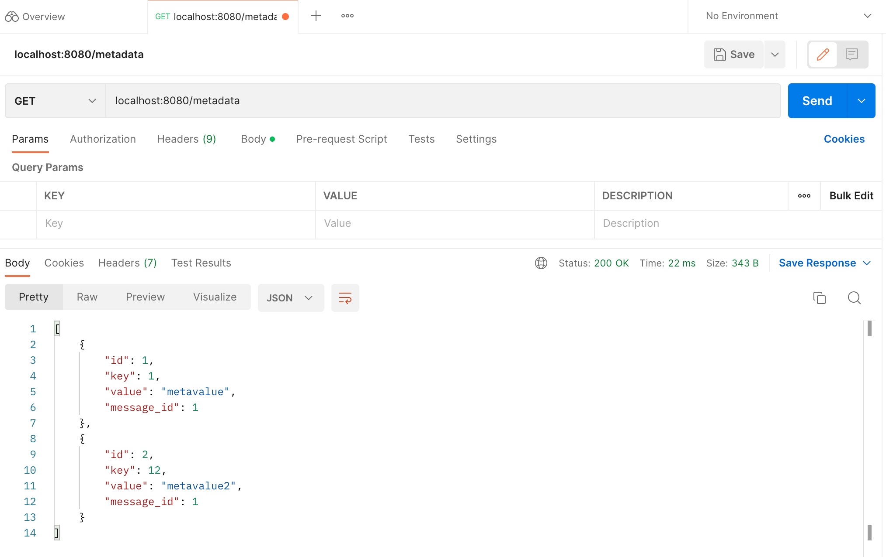
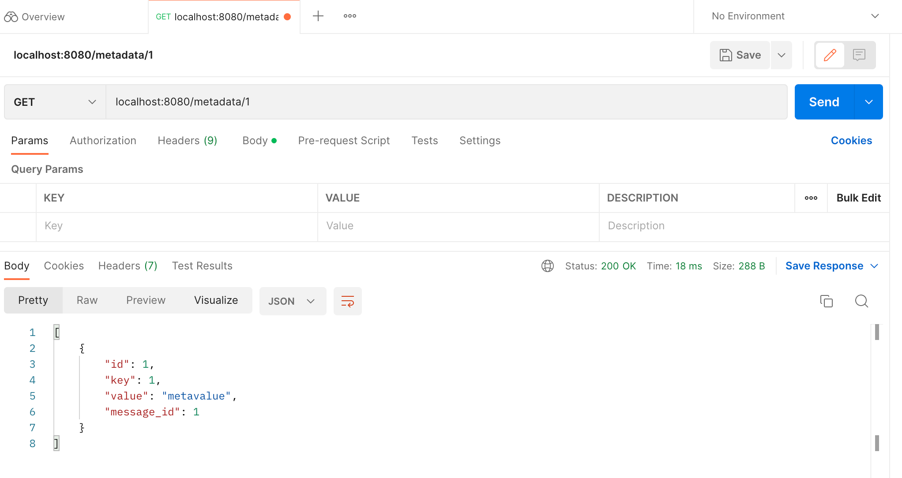
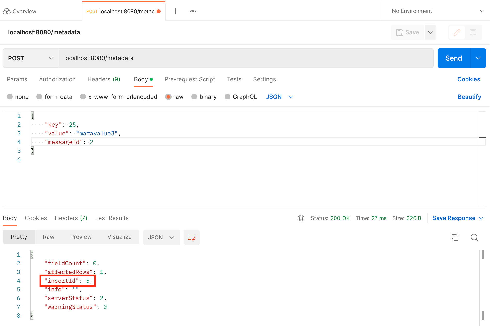
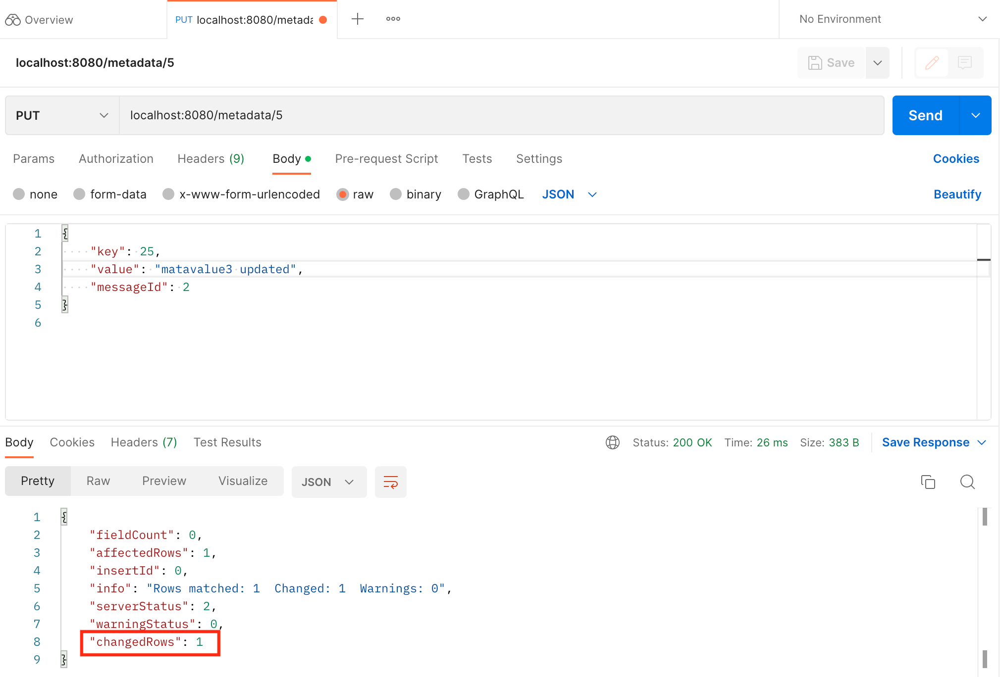
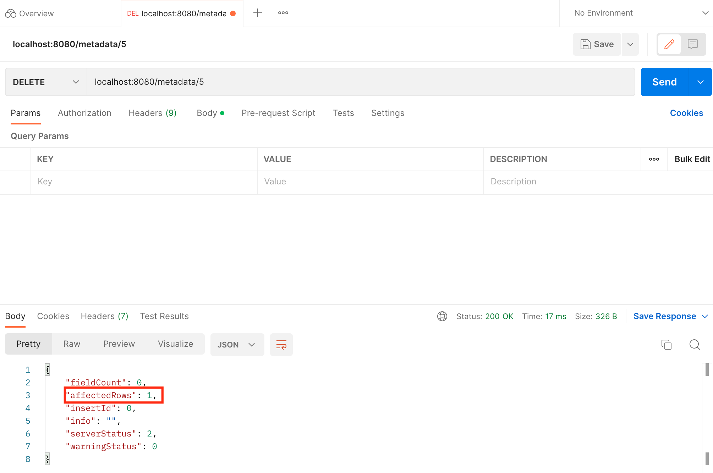

# Тестування працездатності системи

*В цьому розділі необхідно вказати засоби тестування, навести вихідні коди тестів та результати тестування.*

GET запит на отримання всіх повідомлень

  

GET запит на отримання конкретного повідомлення

  

POST запит на збереження нового повідомлення

  

PUT запит на оновлення інформації про повідомлення

  

DELETE запит на видалення повідомлення

  

GET запит на отримання всіх метаданих

  

GET запит на отримання конкретних метаданих

  

POST запит на збереження нових метаданих

  

PUT запит на оновлення існуючих метаданих

  

DELETE запит на видалення метаданих

  

